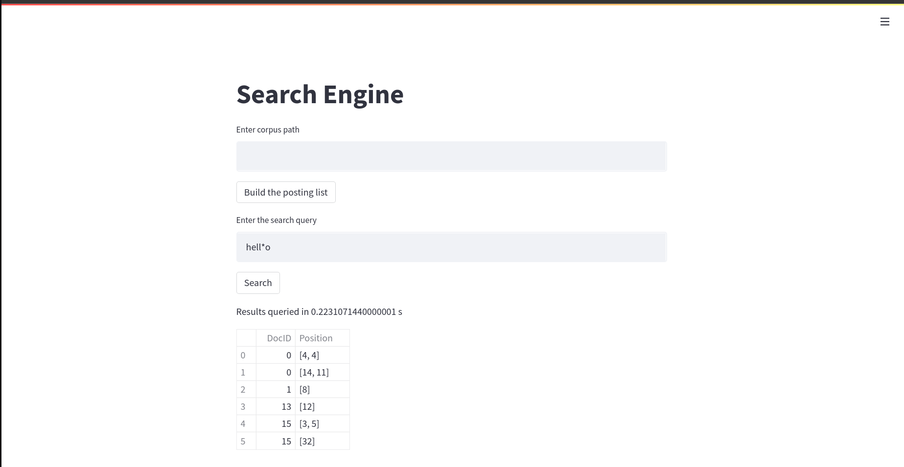

# SearchEngine

## About

This is a streamlit application that functions as an elementary search engine. This application has the following features. 
* Wild card queries
* Boolean queries

As a preprocessing step, a permuterm and a postional posting list is constructed out of any dataset.

## Application in action!

## Built by
[Adithya MS](https://github.com/Adithya-S-Bhat) 
[Mihir M Kestur](https://github.com/mihirkestur) 
[Mohsin Ahmed](https://github.com/Mohsin545-ai) 